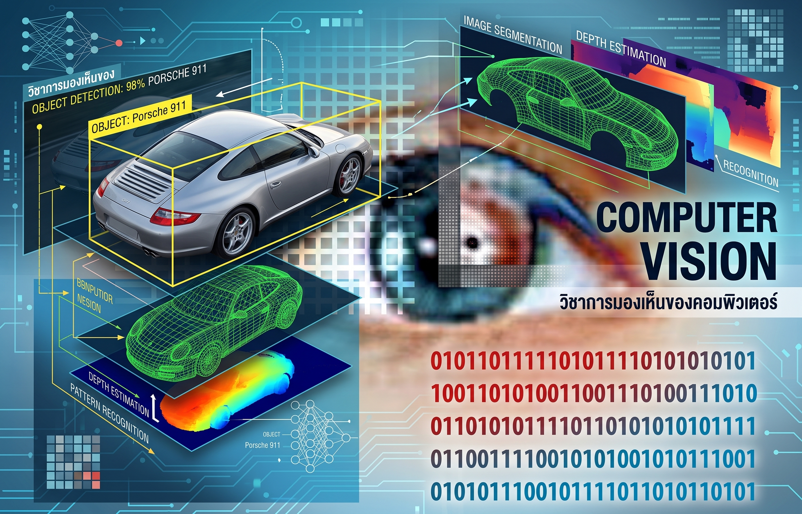

# 2110433 - Computer Vision (2026/1)
Computer Vision @ Chulalongkorn University

In this course, we encourage you to use conda while completing labs.

## Anaconda Download Link
https://www.anaconda.com/download/
## Miniconda and Miniforge Download Link
https://docs.conda.io/en/latest/miniconda.html

## Create Conda Enviroment
conda env create --file environments.yaml

## Open JupyterLab
conda activate chulacv2024\
jupyter-notebook